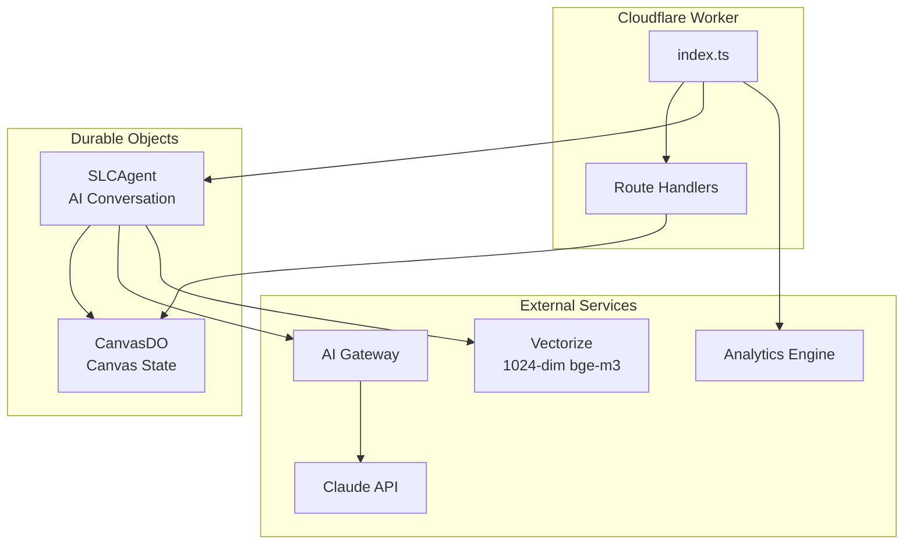
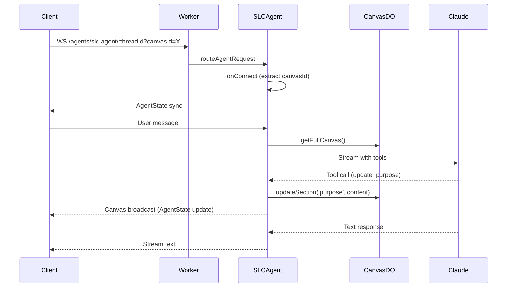
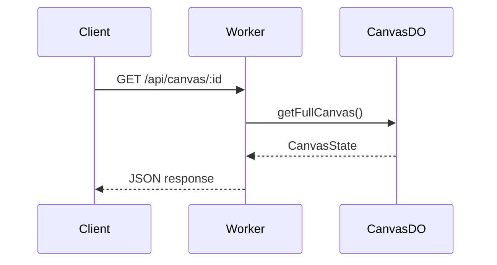

# Backend Architecture

Comprehensive guide to the SLC AI Advisor backend, built on Cloudflare Workers with Durable Objects and the Agents SDK.

## Overview

Two-component architecture separating conversation orchestration from state management:

| Component | Purpose | SDK/Pattern |
|-----------|---------|-------------|
| **SLCAgent** | AI conversation, tool execution | Extends `AIChatAgent` from Agents SDK |
| **CanvasDO** | Canvas state, thread registry | Extends `DurableObject` with SQLite |

## Architecture Diagram



## Request Flow

### WebSocket Flow (AI Conversations)



### REST Flow (Canvas Operations)



---

## Durable Objects

### CanvasDO (29 RPC Methods)

The goal artifact - stores the Social Lean Canvas with all 11 sections, impact model, venture profile, and thread registry.

**File:** `worker/durable-objects/CanvasDO.ts`

#### Canvas Methods (5)

| Method | Purpose |
|--------|---------|
| `getFullCanvas()` | Get complete canvas state with all sections |
| `updateSection(section, content)` | Update a canvas section (routes to managers) |
| `updateImpactField(field, content)` | Update single impact model field |
| `getOverallCompletion()` | Get completion status with percentage |
| `setCurrentSection(section)` | Set current active section (curriculum progress) |

#### Model Methods (4)

| Method | Purpose |
|--------|---------|
| `getCustomerModel()` | Get Customer Model (4 sections) with completion |
| `getEconomicModel()` | Get Economic Model (4 sections) with completion |
| `getImpactModel()` | Get Impact Model (8 fields) with completion |
| `updateFullImpactModel(impactModel)` | Bulk update all 8 impact fields |

#### Venture Profile Methods (3)

| Method | Purpose |
|--------|---------|
| `getVentureProfile()` | Get venture profile with confidence scores |
| `updateVentureProperty(prop, value, confidence?, confirmed?)` | Update a dimension |
| `getPropertiesForFiltering()` | Get high-confidence properties for Selection Matrix |

#### Thread Methods (10)

| Method | Purpose |
|--------|---------|
| `createThread(options?)` | Create new conversation thread |
| `listThreads(includeArchived?)` | List all threads (default: exclude archived) |
| `getThread(threadId)` | Get specific thread metadata |
| `updateThread(threadId, updates)` | Update title, summary, starred |
| `touchThread(threadId)` | Update last_message_at timestamp |
| `archiveThread(threadId)` | Soft-delete thread |
| `restoreThread(threadId)` | Restore archived thread |
| `updateThreadSummary(threadId, summary)` | Set thread summary for cross-thread context |
| `ensureDefaultThread()` | Create default thread if none exists |
| `getThreadSummaries()` | Get all summaries for system prompt context |

#### Canvas Meta Methods (6)

| Method | Purpose |
|--------|---------|
| `getCanvasMeta()` | Get metadata (name, starred, archived, completion) |
| `updateCanvasName(name)` | Update canvas name |
| `updateCanvasStarred(starred)` | Toggle starred status |
| `updateCanvasMeta(updates)` | Bulk update metadata |
| `archiveCanvas()` | Soft-delete canvas |
| `exportCanvas(format)` | Export as 'json' or 'md' |

---

### SLCAgent

AI conversation orchestrator extending `AIChatAgent` from Cloudflare Agents SDK.

**File:** `worker/agents/SLCAgent.ts`

#### AgentState (12 Fields)

State synced to all connected WebSocket clients:

```typescript
interface AgentState {
  // Status
  status: 'idle' | 'thinking' | 'searching' | 'updating' | 'error';
  statusMessage: string;

  // Canvas sync
  canvas: CanvasState | null;
  canvasUpdatedAt: string | null;
  canvasId: string | null;
  threadId: string | null;

  // P1: Configuration & State
  toneProfile: 'beginner' | 'experienced';
  sessionStatus: 'new' | 'in_progress' | 'paused' | 'complete';
  sessionStartedAt: string | null;
  completionPercentage: number;
}
```

#### Lifecycle Hooks

| Method | Purpose |
|--------|---------|
| `onConnect(connection, ctx)` | Extract canvasId from URL, initialize state |
| `onError(connection, error)` | Log error, update status, track metrics |
| `onChatMessage(onFinish)` | Handle user message, stream AI response |

#### Session Lifecycle Methods

| Method | Purpose |
|--------|---------|
| `initializeSession()` | Start session (new → in_progress) or resume from pause |
| `pauseSession()` | Pause session (preserves state) |
| `completeSession()` | Mark session complete |
| `setToneProfile(profileId)` | Change tone mid-session |

#### Helper Methods

| Method | Purpose |
|--------|---------|
| `getCanvasStub(canvasId)` | Get RPC stub for CanvasDO |
| `setStatus(status, message)` | Update agent status (syncs to clients) |
| `broadcastCanvasUpdate()` | Fetch and sync canvas state to clients |
| `getRecentMessages(limit)` | Get messages for cross-thread context (RPC callable) |

---

## SQLite Schema

CanvasDO uses SQLite storage with 5 tables:

```sql
-- Canvas metadata and standalone sections
CREATE TABLE canvas_meta (
  id TEXT PRIMARY KEY DEFAULT 'canvas',
  purpose TEXT NOT NULL DEFAULT '',
  key_metrics TEXT NOT NULL DEFAULT '',
  current_section TEXT,
  name TEXT DEFAULT 'Untitled Canvas',
  starred INTEGER NOT NULL DEFAULT 0,
  archived INTEGER NOT NULL DEFAULT 0,
  created_at TEXT NOT NULL,
  updated_at TEXT NOT NULL
);

-- Customer/Economic model sections
CREATE TABLE canvas_section (
  section_key TEXT PRIMARY KEY,
  content TEXT NOT NULL DEFAULT '',
  is_complete INTEGER NOT NULL DEFAULT 0,
  updated_at TEXT NOT NULL
);

-- Impact Model (8-field causality chain)
CREATE TABLE impact_model (
  id TEXT PRIMARY KEY DEFAULT 'impact',
  issue TEXT NOT NULL DEFAULT '',
  participants TEXT NOT NULL DEFAULT '',
  activities TEXT NOT NULL DEFAULT '',
  outputs TEXT NOT NULL DEFAULT '',
  short_term_outcomes TEXT NOT NULL DEFAULT '',
  medium_term_outcomes TEXT NOT NULL DEFAULT '',
  long_term_outcomes TEXT NOT NULL DEFAULT '',
  impact TEXT NOT NULL DEFAULT '',
  is_complete INTEGER NOT NULL DEFAULT 0,
  updated_at TEXT NOT NULL
);

-- Venture Profile (Selection Matrix dimensions)
CREATE TABLE venture_profile (
  id TEXT PRIMARY KEY DEFAULT 'profile',
  venture_stage TEXT,
  impact_areas TEXT NOT NULL DEFAULT '[]',
  impact_mechanisms TEXT NOT NULL DEFAULT '[]',
  legal_structure TEXT,
  revenue_sources TEXT NOT NULL DEFAULT '[]',
  funding_sources TEXT NOT NULL DEFAULT '[]',
  industries TEXT NOT NULL DEFAULT '[]',
  confidence_json TEXT NOT NULL DEFAULT '{}',
  confirmed_json TEXT NOT NULL DEFAULT '{}',
  created_at TEXT NOT NULL,
  updated_at TEXT NOT NULL
);

-- Thread registry (conversations)
CREATE TABLE thread (
  id TEXT PRIMARY KEY,
  title TEXT,
  summary TEXT,
  starred INTEGER NOT NULL DEFAULT 0,
  archived INTEGER NOT NULL DEFAULT 0,
  created_at TEXT NOT NULL,
  last_message_at TEXT NOT NULL
);

CREATE INDEX idx_thread_last_message
ON thread(last_message_at DESC)
WHERE archived = 0;
```

**Schema versioning:** Uses `PRAGMA user_version` for migrations.

---

## Tool System

13 AI tools in 3 categories, defined in `worker/agents/tools/`.

### Canvas Tools (7)

| Tool | Purpose | File |
|------|---------|------|
| `get_canvas` | Get current canvas state | `canvas/get-canvas.ts` |
| `update_purpose` | Update purpose section | `canvas/update-purpose.ts` |
| `update_customer_section` | Update Customer Model section | `canvas/update-customer-section.ts` |
| `update_economic_section` | Update Economic Model section | `canvas/update-economic-section.ts` |
| `update_impact_field` | Update Impact Model field | `canvas/update-impact-field.ts` |
| `update_key_metrics` | Update key metrics section | `canvas/update-key-metrics.ts` |

### Knowledge Tools (3)

| Tool | Purpose | File |
|------|---------|------|
| `search_examples` | Search venture examples via Vectorize | `knowledge/search-examples.ts` |
| `search_knowledge` | Search methodology knowledge | `knowledge/search-knowledge.ts` |
| `search_methodology` | Search SLC framework guidance | `knowledge/search-methodology.ts` |

### Meta Tools (3)

| Tool | Purpose | File |
|------|---------|------|
| `get_completion_status` | Get canvas completion percentage | `meta/get-completion-status.ts` |
| `get_venture_profile` | Get venture dimensions | `meta/get-venture-profile.ts` |
| `get_thread_context` | Get messages from another thread | `meta/get-thread-context.ts` |

### Tool Execution

Tools are executed via `executeToolWithBroadcast()` which:
1. Looks up tool by name
2. Executes tool function with context
3. Triggers canvas broadcast for update tools
4. Returns result to Claude

---

## Observability

Structured logging and metrics via Analytics Engine.

**Files:** `worker/observability/logger.ts`, `worker/observability/metrics.ts`

### Logger

```typescript
const logger = createLogger('SLCAgent', requestId);
logger.info('Processing request', { userId: '123' });
logger.error('Failed to update', error, { section: 'purpose' });

// Timed operations
const timer = logger.startTimer('db-query');
// ... do work ...
timer.end({ rowCount: 10 });
```

**Log levels:** `debug`, `info`, `warn`, `error`

**Output format:** JSON to console (captured by Cloudflare dashboard)

### Metrics

```typescript
const metrics = createMetrics(env.SLC_ANALYTICS);
metrics.trackEvent('message_received', { sessionId });
metrics.trackEvent('tool_executed', { sessionId, toolName, success: true, durationMs });

// Timed operations
const endTimer = metrics.startTimer('message_sent', { sessionId });
// ... do work ...
endTimer();
```

**Event types:**
- `message_received` - User message received
- `message_sent` - AI response completed
- `tool_executed` - Tool execution (success/failure, duration)
- `canvas_created` - New canvas created
- `canvas_updated` - Canvas section updated
- `rag_query` - Vectorize search performed
- `session_created` - New session started
- `error` - Error occurred

---

## Configuration

### wrangler.toml Bindings

```toml
[[durable_objects.bindings]]
name = "CANVAS"
class_name = "CanvasDO"

[[durable_objects.bindings]]
name = "SLC_AGENT"
class_name = "SLCAgent"

[[vectorize]]
binding = "VECTORIZE"
index_name = "slc-knowledge"

[[analytics_engine_datasets]]
binding = "SLC_ANALYTICS"
```

### Environment Secrets

| Secret | Purpose |
|--------|---------|
| `CF_ACCOUNT_ID` | Cloudflare account ID |
| `CF_GATEWAY_ID` | AI Gateway ID |
| `ANTHROPIC_API_KEY` | Claude API key |
| `CF_AIG_TOKEN` | AI Gateway auth token (optional, for authenticated gateway) |

### AI Gateway Configuration

```typescript
const client = new Anthropic({
  apiKey: env.ANTHROPIC_API_KEY,
  baseURL: `https://gateway.ai.cloudflare.com/v1/${env.CF_ACCOUNT_ID}/${env.CF_GATEWAY_ID}/anthropic`,
  defaultHeaders: {
    'cf-aig-authorization': `Bearer ${env.CF_AIG_TOKEN}`, // if authenticated
  },
});
```

---

## Multi-Canvas/Thread Architecture

```
User → Canvas 1 → Thread A → SLCAgent A (WebSocket)
                → Thread B → SLCAgent B (WebSocket)
     → Canvas 2 → Thread C → SLCAgent C (WebSocket)
```

- **One SLCAgent per thread**: Each conversation is a separate DO instance
- **CanvasDO as thread registry**: Stores thread metadata (title, summary, starred, archived)
- **Canvas registry**: localStorage + backend verification (see `src/utils/canvasRegistry.ts`)
- **WebSocket URL**: `/agents/slc-agent/{threadId}?canvasId={canvasId}`

See [multi-canvas-architecture.md](../spec/slc-ai-advisor-mvp/multi-canvas-architecture.md) for auth migration path.

---

## Key Files

| Purpose | File |
|---------|------|
| Entry point | `worker/index.ts` |
| SLCAgent | `worker/agents/SLCAgent.ts` |
| System prompts | `worker/agents/prompts.ts` |
| Tone profiles | `worker/config/tone-profiles.ts` |
| CanvasDO | `worker/durable-objects/CanvasDO.ts` |
| Canvas routes | `worker/routes/canvas.ts` |
| Session routes | `worker/routes/session.ts` |
| Tool definitions | `worker/agents/tools/` |
| Logger | `worker/observability/logger.ts` |
| Metrics | `worker/observability/metrics.ts` |
| Canvas types | `src/types/canvas.ts` |
| Venture types | `src/types/venture.ts` |
